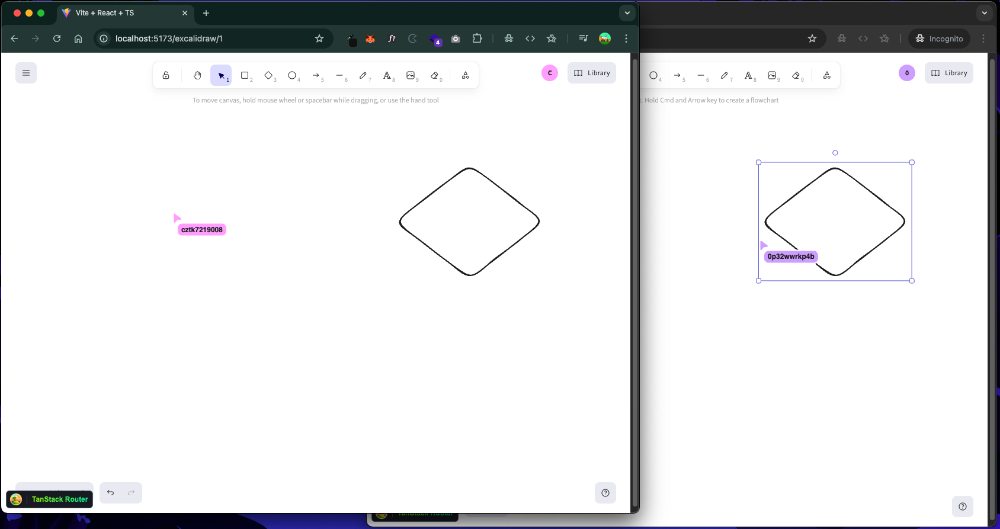

# Excalidraw Realtime Clone (React + Hono + Cloudflare Workers)



## Overview

This project is a lightweight, production‑grade example of a collaborative whiteboard built on top of Excalidraw with true realtime sync. It uses Cloudflare Workers and Durable Objects to host a stateful WebSocket server per “room,” and a React SPA for the client UI. Each drawing room is identified by `:drawId` and maps to a single Durable Object instance that maintains the canonical scene and broadcasts live updates to connected clients.

Use this as a reference for building low‑latency, globally available realtime apps (whiteboards, multiplayer canvases, cursors, and shared documents) without running your own servers.

## Key features

- Realtime collaboration over WebSockets (live cursors and scene updates)
- Room-per-drawing via Durable Objects (`idFromName(drawId)`) for isolated state
- Initial state sync on connect from DO storage ("cold start" resume)
- Client‑side event buffering (10ms) to reduce network chatter
- SPA routing with URL rooms: `/excalidraw/:drawId`
- Type‑safe message contracts with Zod

## Architecture

- Client: React app (Vite + TanStack Router) renders Excalidraw and opens a WebSocket to `/api/ws/:drawingId`.
- Edge runtime: Cloudflare Worker (Hono) upgrades the request and forwards it to a Durable Object instance identified by `drawingId`.
- Durable Object: Holds the authoritative scene (array of elements), broadcasts messages to all connected sockets, and persists element changes to DO storage.

Request/flow

1. Client connects → sends a `"setup"` message.
2. Durable Object responds with the current scene `{ type: "elementChange", data: [...] }`.
3. Clients send two kinds of events:
   - `pointer` (live cursor), not persisted; broadcast only.
   - `elementChange` (scene elements), persisted and broadcast.

## Tech stack

- React 19, Vite 6, TanStack Router 1.x
- Excalidraw UI (`@excalidraw/excalidraw`)
- Hono (HTTP router) on Cloudflare Workers
- Cloudflare Durable Objects for stateful, per‑room coordination
- Zod for runtime validation of socket messages

## Project structure (high‑level)

- `src/react-app/components/ExcalidrawComponent.tsx` – Canvas UI, socket integration, scene updates
- `src/react-app/hooks/socket.tsx` – Buffered WebSocket client (`ws://localhost:5173/api/ws/:id` in dev)
- `src/react-app/routes/excalidraw/$drawId.tsx` – Route that provides the `drawId` room param
- `src/types/event.schema.ts` – Zod schemas and TypeScript types for socket payloads
- `src/worker/index.ts` – Hono app and `/api/ws/:drawingId` upgrade endpoint
- `src/worker/durable-object.ts` – `ExcalidrawWebSocketServer` DO: broadcast + persistence
- `wrangler.json` – Worker, Durable Object binding and assets config
- `vite.config.ts` – Vite + Cloudflare + TanStack Router plugins

## How it works (contract)

Messages

- Pointer event
  - Shape: `{ type: "pointer", data: { userId: string, x: number, y: number } }`
  - Behavior: broadcast to all clients in the room; not stored.
- Element change
  - Shape: `{ type: "elementChange", data: any[] }` (Excalidraw elements array)
  - Behavior: stored in DO storage under the room, and broadcast.

On connect

- Client sends `"setup"` → DO replies with `{ type: "elementChange", data: <persisted elements> }` so the canvas hydrates immediately.

Buffering

- The client buffers frequent events for ~10ms and flushes them together to lower socket pressure. Pointer events are keyed by user, element changes by a fixed key (latest wins per tick).

## Getting started

Prerequisites

- Bun 1.0+ installed
- A Cloudflare account for deployment

Install

```bash
bun install
```

Run locally

```bash
bun run dev
```

Then open: http://localhost:5173/excalidraw/my-room-id

Open the same URL in a second tab or device to see realtime collaboration.

Build & preview (production bundle)

```bash
bun run build
bun run preview
```

Quality checks

```bash
bun run lint      # eslint
bun run check     # typecheck + build + wrangler dry-run
```

## Deploy to Cloudflare

This project ships with `wrangler` configured locally.

```bash
bun run deploy
```

Notes

- The Durable Object is bound as `DURABLE_OBJECT` and class `ExcalidrawWebSocketServer`.
- First deploy applies the migration `v1` that registers the DO class.
- Static assets are served from `./dist/client` with SPA fallback.

Key `wrangler.json` entries

```jsonc
{
  "main": "./src/worker/index.ts",
  "durable_objects": {
    "bindings": [
      { "class_name": "ExcalidrawWebSocketServer", "name": "DURABLE_OBJECT" },
    ],
  },
  "migrations": [{ "tag": "v1", "new_classes": ["ExcalidrawWebSocketServer"] }],
  "assets": {
    "directory": "./dist/client",
    "not_found_handling": "single-page-application",
  },
}
```

## Limitations and next steps

- No authentication or access control (all users can join with a URL)
- Writes send the full elements array on pointer up; you may want granular diffs/OT/CRDTs
- No persistence history or versioning; last write wins
- Basic error handling on sockets; add retries/backoff and analytics
- Production hardening: rate limiting, payload limits, room limits, and observability

Potential enhancements

- Presence and avatars, names, and colors
- Element‑level deltas, undo/redo across clients
- Persist to KV / D1 / R2 depending on needs; snapshot + incremental journal
- Share links with tokens and permissions

## Acknowledgements

- Built with [Excalidraw](https://github.com/excalidraw/excalidraw), [Hono](https://hono.dev/), and [Cloudflare Workers](https://developers.cloudflare.com/workers/).

## License

This repository does not currently include a license. Consider adding one (e.g., MIT) if you intend others to use or modify this code.
